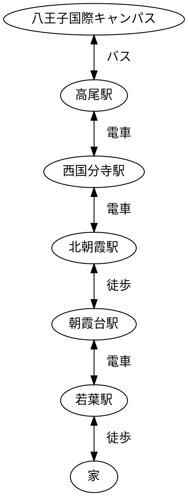

<<<<<<< HEAD
# 北川の通学経路

[メンバー表に戻る](member.md#メンバー表)

```graphviz
digraph {
    edge [dir=both]

    八王子国際キャンパス -> 高尾駅 [label = 　バス]
    高尾駅 -> 西国分寺駅 [label = 　電車]
    西国分寺駅 -> 北朝霞駅 [label = 　電車]
    北朝霞駅 -> 朝霞台駅 [label = 　徒歩]
    朝霞台駅 -> 若葉駅 [label = 　電車]
    若葉駅 -> 家 [label = 　徒歩]
    
}
```
